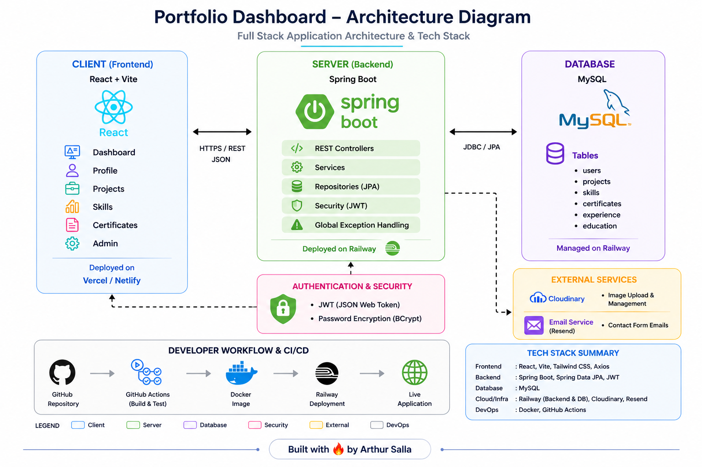

# 📊 Portfolio Dashboard – Full Stack Developer Showcase

🚀 Live Demo: https://arthur-portfolio-dashboard.netlify.app

---

## 📌 Overview

A full-stack portfolio dashboard designed to showcase projects through a live, interactive interface.

Unlike traditional static resumes, this application demonstrates real-world engineering practices including frontend-backend separation, API-driven architecture, and cloud deployment.

---

## 🎯 Purpose

Traditional resumes don’t effectively demonstrate engineering capabilities.

This project was built to:
- Showcase full-stack development skills  
- Demonstrate real-world deployment workflows  
- Provide a dynamic and interactive portfolio experience  
- Serve as a live, evolving representation of my work  

---

## 🧱 Tech Stack

**Frontend**
- React (Vite)
- Tailwind CSS
- Toastify
- Framer Motion

**Backend**
- Spring Boot (Java 17)
- REST APIs
- Spring Mail (JavaMailSender)
- MySQL Database

**Deployment**
- Railway (Backend)
- Netlify (Frontend)

---

## ⚙️ Key Features

### 🔐 Admin Control
- Hidden **Admin Login** accessible from the footer  
- Admin-only CRUD for **Projects** and **Skills**
- Unauthorized users see friendly toast messages: “Only admins can modify content.”

### 🎨 Dynamic & Responsive UI
- Clean dashboard layout with collapsible skill categories  
- Animated transitions powered by **Framer Motion**  
- Mobile-friendly design using **Tailwind CSS**

### 💬 Real Contact Integration
- Live **contact form** connected to Gmail via **Spring Boot Mail**
- Sends messages straight to the owner’s inbox  
- Fallback toast + on-screen notice when backend is unreachable

### ⚡ Performance & Offline
- Smart local caching for faster reloads  
- Graceful fallback when backend API is unavailable

### 🔒 Security
- Environment variables for all credentials (`GMAIL_USERNAME`, `GMAIL_PASSWORD`)  
- Gmail App Password used — never stored in code

---

## 🏗️ Architecture

This project follows a clean full-stack architecture with a React frontend, Spring Boot backend, and MySQL database, deployed on Railway.

---

## API Documentation

The Spring Boot backend exposes OpenAPI documentation through Swagger UI.

1. Start the backend from portfolio-dashboard-backend
2. Open Swagger UI at https://portfolio-dashboard-backend-production.up.railway.app/pdbapp/swagger-ui/index.html
3. Open the raw OpenAPI JSON at `https://portfolio-dashboard-backend-production.up.railway.app/pdbapp/v3/api-docs`.

Admin-only create, update, and delete endpoints use HTTP Basic authentication with the configured `APP_ADMIN_USERNAME` and `APP_ADMIN_PASSWORD` values.

